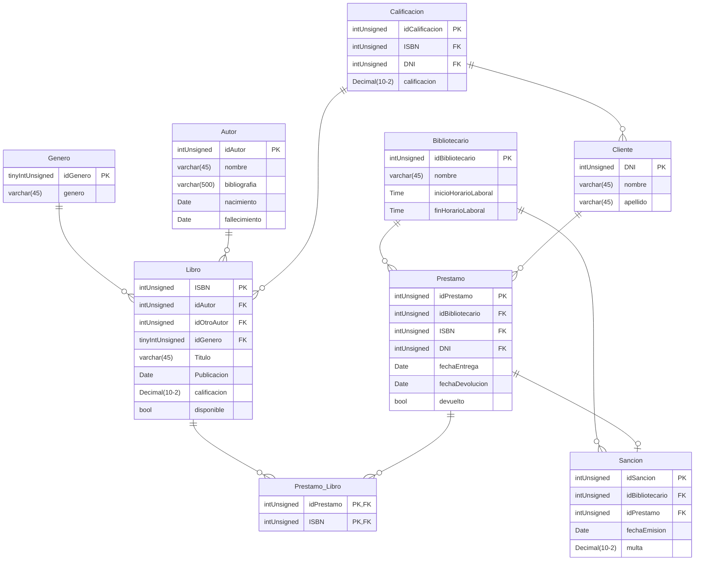

# ***BD_BIBLIOTECA***
# *By CiverAbentureros*

## Integrantes

- ### Algañaras Diego
- ### Lopez Angel
- ### Pasandi Luka

# DER

<div align="center">


</div>

# Consultas

- ### Obtener el número total de libros por género, incluyendo géneros sin libros, la cantidad de libros renombrarla como "TotalLibros", ordenar por cantidad de libros de mayor a menor.

```sql
SELECT genero, COUNT(ISBN) AS TotalLibros
FROM Genero G
LEFT JOIN Libro L ON G.idGenero = L.idGenero
GROUP BY genero
ORDER BY COUNT(ISBN) DESC;
```

- ### Mostrar los géneros que tienen más de un libro.

```sql
SELECT genero, COUNT(L.ISBN) AS TotalLibros
FROM Genero G
INNER JOIN Libro L ON G.idGenero = L.idGenero
GROUP BY genero
HAVING TotalLibros > 1;
```

- ### Mostrar el nombre de los bibliotecarios y su cantidad de prestamos, solo si han emitido mas de 4, ordenar de mayor a menor por cantidad de prestamos.

```sql
SELECT nombre, COUNT(idPrestamo) AS TotalPrestamos
FROM Bibliotecario B
INNER JOIN Prestamo P ON B.idBibliotecario = P.idBibliotecario
GROUP BY nombre
HAVING TotalPrestamos > 4
ORDER BY COUNT(idPrestamo);
```

-  ### Obtener el nombre y la fecha de nacimiento de aquellos autores que hayan emitido 2 o mas libros, ordenar de menor a mayor por año de nacimiento. 

```sql
SELECT nombre, nacimiento
FROM Autor A
INNER JOIN Libro L ON L.idAutor = A.idAutor
GROUP BY nombre, nacimiento
HAVING COUNT(*) > 2
ORDER BY nacimiento ASC;
```

- ### Mostrar el nombre del bibliotecario, la cantidad de sanciones que emitio y el destinatario de las sanciones, solo si la multa supera los 5000, ordenar por el nombre de los bibliotecarios de menor a mayor.

```sql
SELECT B.nombre, COUNT(*) AS TotalSanciones, C.nombre
FROM Bibliotecario B###
INNER JOIN Sancion S ON B.idBibliotecario = S.idBibliotecario
INNER JOIN Prestamo P ON P.idPrestamo = S.idPrestamo
INNER JOIN Cliente C ON C.DNI = P.DNI 
WHERE multa > 5000
GROUP BY B.nombre, C.nombre
ORDER BY B.nombre;
```


# Funciones

- ### Realizar una función que reciba como parametros, un DNI y dos fechas, con el fin de que muestre la suma total de todas las multas correspondientes a un cliente entre dichas fechas:

```sql
DELIMITER $$
DROP FUNCTION IF EXISTS sumaMultas $$
CREATE FUNCTION SumaMultas (unDNI INT UNSIGNED, minFecha DATE, maxFecha DATE)
RETURNS DECIMAL(10,2)
READS SQL DATA
BEGIN
    DECLARE sumaMultas DECIMAL;
    SELECT SUM(multa) INTO sumaMultas
    FROM Prestamo
    JOIN Sancion USING (idPrestamo)
    WHERE unDNI = DNI
    AND fechaEmision BETWEEN minFecha AND maxFecha;
    RETURN sumaMultas;
END $$
```

- ### Crear una función que reciba como parametro un idAutor y que muestre la cantidad de libros que posee el mismo:

```sql
DELIMITER $$
DROP FUNCTION IF EXISTS LibrosAutor $$
CREATE FUNCTION LibrosAutor (unIdAutor INT UNSIGNED)
RETURNS INT
READS SQL DATA
BEGIN
    DECLARE LibrosAutor INT;
    SELECT COUNT(*) INTO LibrosAutor
    FROM Libro
    WHERE idAutor = unIdAutor;
    RETURN LibrosAutor;
END $$
```

- ### Crear una funcion que reciba como parametro un idPrestamo, con el fin de calcular la cantidad de días restantes antes del vencimiento del mismo:

```sql
DELIMITER $$
DROP FUNCTION IF EXISTS DiasRestantes $$
CREATE FUNCTION DiasRestantes (unIdPrestamo INT UNSIGNED)
RETURNS INT
READS SQL DATA
BEGIN
    DECLARE DiasRestantes INT;
    SELECT DATEDIFF(fechaDevolucion, fechaEntrega) INTO DiasRestantes
    FROM Prestamo
    WHERE idPrestamo = unIdPrestamo;
    RETURN DiasRestantes;
END $$
```

- ### Crear una función que reciba como parametro un ISBN (PK de libro) y que en base a eso me muestre la cantidad total de veces que fue alquilado:

```sql
DELIMITER $$
DROP FUNCTION IF EXISTS CantPrestamos $$
CREATE FUNCTION CantPrestamos (unISBN INT UNSIGNED)
RETURNS INT
READS SQL DATA
BEGIN
    DECLARE CantPrestamos INT;
    SELECT COUNT(*) INTO CantPrestamos
    FROM Prestamo
    WHERE ISBN = unISBN;
    RETURN CantPrestamos;
END $$
```
# Procedimientos

- ### Crear los SP necesarios para dar de alta en todas las tablas:

```sql
DELIMITER $$
DROP PROCEDURE IF EXISTS altaBibliotecario $$
CREATE PROCEDURE altaBibliotecario (unIdBibliotecario INT, unNombre VARCHAR(45), unInicioHoraLaboral TIME, unFinHoraLaboral TIME)
BEGIN
   INSERT INTO Bibliotecario (idBibliotecario, nombre, inicioHoraLaboral, finHoraLaboral)
       VALUES (unIdBibliotecario, unNombre, unInicioHoraLaboral, unFinHoraLaboral);
END $$
```
```sql
DELIMITER $$
DROP PROCEDURE IF EXISTS altaGenero $$
CREATE PROCEDURE altaGenero (unIdGenero TINYINT UNSIGNED, unGenero VARCHAR(45))
BEGIN
   INSERT INTO Genero (idGenero, genero)
       VALUES (unIdGenero, unGenero);
END $$
```
```sql
DELIMITER $$
DROP PROCEDURE IF EXISTS altaAutor $$
CREATE PROCEDURE altaAutor (unIdAutor INT UNSIGNED, unNombre VARCHAR(45), unaBibliografia VARCHAR(500), unNacimiento DATE, unFallecimiento DATE)
BEGIN
   INSERT INTO Autor (idAutor, nombre, bibliografia, nacimiento, fallecimiento)
       VALUES( unIdAutor, unNombre, unaBibliografia, unNacimiento, unFallecimiento);
END $$
```
```sql
DELIMITER $$
DROP PROCEDURE IF EXISTS altaCliente $$
CREATE PROCEDURE altaCliente (unDNI INT UNSIGNED, unNombre VARCHAR(45), unApellido VARCHAR(45))
BEGIN
   INSERT INTO Cliente (DNI, nombre, apellido)
       VALUES (unDNI, unNombre, unApellido);
END $$
```
```sql
DELIMITER $$
DROP PROCEDURE IF EXISTS altaLibro $$
CREATE PROCEDURE altaLibro (unISBN INT, unIdAutor INT, unIdOtroAutor INT, unIdGenero TINYINT UNSIGNED, unTitulo VARCHAR(45), unaPublicacion DATE, unaCalificacion Decimal(10,2))
BEGIN
    INSERT INTO Libro (ISBN, idAutor, idOtroAutor, idGenero, Titulo, Publicacion, calificacion)
        VALUES(unISBN, unIdAutor, unIdOtroAutor, unIdGenero, unTitulo, unaPublicacion, unaCalificacion);
END $$
```
```sql
DELIMITER $$
DROP PROCEDURE IF EXISTS altaPrestamo $$
CREATE PROCEDURE altaPrestamo (unIdPrestamo INT, unIdBibliotecario INT, unISBN INT, unDNI INT, unaFechaEntrega DATE, unaFechaDevolucion DATE)
BEGIN
    INSERT INTO Prestamo (idPrestamo, idBibliotecario, ISBN, DNI, FechaEntrega, FechaDevolucion)
    VALUES(unIdPrestamo, unIdBibliotecario, unISBN, unDNI, unaFechaEntrega, unaFechaDevolucion);
END $$
```
```sql
DELIMITER $$
DROP PROCEDURE IF EXISTS altaSancion $$
CREATE PROCEDURE altaSancion (unIdSancion INT UNSIGNED, unIdBibliotecario INT UNSIGNED, unIdPrestamo INT UNSIGNED, unaFechaEmision DATE, unaMulta DECIMAL(10,2))
BEGIN
    INSERT INTO Sancion (idSancion, idBibliotecario, idPrestamo, fechaEmision, Multa)
    VALUES(unIdSancion, unIdBibliotecario, unIdPrestamo, unaFechaEmision, unaMulta);
END $$
```
```sql
DELIMITER $$
DROP PROCEDURE IF EXISTS altaCalificacion $$
CREATE PROCEDURE altaCalificacion (unIdCalificacion INT UNSIGNED, unISBN INT UNSIGNED, unDNI INT UNSIGNED, unaCalificacion TINYINT UNSIGNED)
BEGIN
    INSERT INTO Calificacion (idCalificacion, ISBN, DNI, calificacion)
    VALUES(unIdCalificacion, unISBN, unDNI, unaCalificacion);
END $$
```

- ### Crear un SP que te permita saber qué prestamos se hicieron en un mes y año especifico:

```sql
DELIMITER $$
DROP PROCEDURE IF EXISTS prestamosEn $$
CREATE PROCEDURE prestamosEn(unMes INT, unAnio INT)
BEGIN
    SELECT P.idPrestamo, L.Titulo, CL.nombre, CL.apellido, BI.nombre 'Bibliotecario', P.fechaEntrega, P.fechaDevolucion
    FROM Prestamo P
    JOIN Libro L using (ISBN)
    JOIN Cliente CL using (DNI)
    JOIN Bibliotecario BI using (idBibliotecario)
    WHERE MONTH(P.fechaEntrega) = unMes
    AND YEAR(P.fechaEntrega) = unAnio
    ORDER BY P.fechaEntrega ASC;
END $$
```

- ### Crear un SP que te permita eliminar un libro si no está activo en ningún prestamo:

```sql
DELIMITER $$
DROP PROCEDURE IF EXISTS bajaLibroSiNoPrestado $$
CREATE PROCEDURE bajaLibroSiNoPrestado (unISBN INT)
BEGIN
    IF (EXISTS (SELECT *
                FROM Prestamo_Libro
                WHERE ISBN = unISBN))
    THEN
        SIGNAL SQLSTATE '45000'
        SET MESSAGE_TEXT = 'No se puede eliminar el libro; está activo en uno o mas prestamos.';
    ELSE
        DELETE FROM calificacion
        WHERE ISBN = unISBN;

        DELETE sancion
        FROM sancion
        JOIN prestamo using (idPrestamo)
        JOIN prestamo_libro PL using (idPrestamo)
        WHERE `Prestamo_Libro`.`ISBN` = unISBN;

        DELETE FROM Prestamo_Libro
        WHERE ISBN = unISBN;

        UPDATE Libro
        SET disponible = FALSE  
        WHERE ISBN = unISBN;
    END IF;
END $$
```
# Vistas 

- ### Crear una vista que muestre la califacion promedio de los libros por cada autor:
```sql
DROP VIEW IF EXISTS vistaPromedioCalificacionLibrosxAutor;
CREATE VIEW vistaPromedioCalificacionLibrosxAutor AS
    SELECT nombre, AVG(calificacion) AS 'Calificacion promedio'
    FROM Autor
    JOIN Libro USING (idAutor)
    GROUP BY nombre;
```

- ### Crear una vista que muestre los libros no disponibles:

```sql
DROP VIEW IF EXISTS vistaLibrosNoDisponibles;
CREATE VIEW vistaLibrosNoDisponibles AS
    SELECT ISBN, Titulo, A.nombre 'Autor', G.genero, disponible
    FROM Libro
    JOIN autor A using (idAutor)
    JOIN genero G using (idGenero)
    WHERE disponible = FALSE;
```

- ### Crear una vista que te muestre la cantidad de prestamos por cliente:

```sql
DROP VIEW IF EXISTS vistaCantidadPrestamos;
CREATE VIEW vistaCantidadPrestamos AS
    SELECT C.DNI, C.nombre, C.apellido, COUNT(P.idPrestamo) 'CantidadPrestamos'
    FROM Cliente C
    JOIN Prestamo P using (DNI)
    GROUP BY C.DNI, C.nombre, C.apellido
    ORDER BY CantidadPrestamos DESC;
```

- ### Crear una vista que muestre información general con cada préstamo, con el cliente que lo hizo, los libros, el bibliotecario encargado, fechas de entrega y devolución, estado del préstamo, posibles calificaciones asignadas a los libros y sanciones aplicadas:

```sql
DROP VIEW IF EXISTS vistaGeneral;
CREATE VIEW vistaGeneral AS
    SELECT P.idPrestamo, CL.nombre 'Cliente', GROUP_CONCAT(DISTINCT L.titulo SEPARATOR ', ') 'Libros', B.nombre 'Bibliotecario', P.fechaEntrega, P.fechaDevolucion, P.devuelto, GROUP_CONCAT(DISTINCT CA.calificacion SEPARATOR ', ') 'Calificaciones', GROUP_CONCAT(S.multa) 'Multa', GROUP_CONCAT(S.fechaEmision) 'FechaDeEmision'
    FROM Prestamo P
    JOIN Cliente CL using (DNI)
    JOIN Libro L ON P.ISBN = L.ISBN
    JOIN Bibliotecario B using (idBibliotecario)
    LEFT JOIN Calificacion CA ON CA.ISBN = L.ISBN AND CA.DNI = P.DNI
    LEFT JOIN Sancion S ON S.idPrestamo = P.idPrestamo
    GROUP BY idPrestamo;
```

# Triggers

- ### Crear un trigger que al hacer un insert en Calificacion, saque el promedio de todas las calificaciones de la calificacion del libro seleccionado, y actualize con ese valor en la correspondiente fila en la tabla Libro: 

```sql
DELIMITER $$
DROP TRIGGER IF EXISTS aftInsCalificacion $$
CREATE TRIGGER aftInsCalificacion AFTER INSERT ON Calificacion
FOR EACH ROW
BEGIN
    UPDATE Libro
    SET calificacion = (SELECT AVG(calificacion)
                       FROM Calificacion
                       WHERE ISBN = NEW.ISBN)
    WHERE ISBN = NEW.ISBN;
END $$
```

- ### Crear un trigger que no permita hacer un prestamo, si el libro no se encuentra disponible (Libro.disponible):

```sql
DELIMITER $$
DROP TRIGGER IF EXISTS befInsPrestamo $$
CREATE TRIGGER befInsPrestamo BEFORE INSERT ON Prestamo
FOR EACH ROW
BEGIN
    IF (!(SELECT disponible
          FROM Libro
          WHERE ISBN = NEW.ISBN))
    THEN
        SIGNAL SQLSTATE "45000"
        SET MESSAGE_TEXT = "El libro que se quiere utilizar no se encuentra disponible";
    END IF;
END $$
```

- ### Crear un trigger befInsPrestamo donde el cliente haga un prestamo si es que no tiene mas de 3 sanciones:

```sql
DELIMITER $$
DROP TRIGGER IF EXISTS befInsPrestamo $$
CREATE TRIGGER befInsPrestamo BEFORE INSERT ON Prestamo
FOR EACH ROW
BEGIN
    IF(3 < (SELECT COUNT(*) 
       FROM Sancion 
       JOIN Prestamo USING (idPrestamo) 
       WHERE DNI = NEW.DNI))
    THEN
        SIGNAL SQLSTATE "45000"
        SET MESSAGE_TEXT = "No se puede hacer un prestamo debido a que el Cliente que lo solita posee mas de tres sanciones";
    ELSE IF(FALSE = (SELECT disponible
                     FROM Libro
                     WHERE ISBN = NEW.ISBN))
    THEN
        SIGNAL SQLSTATE "45000"
        SET MESSAGE_TEXT = "No se puede efectuar un prestamo sobre un libro que no se encuentra disponible (Libro.disponible = 0)";
    END IF;
END $$
```


# Check

- ### Crear un Check el cual no permita ingresar valores de calificaciones menores a 0 ni mayores que 10:

```sql
CREATE TABLE Calificacion(
    idCalificacion INT UNSIGNED,
    ISBN INT UNSIGNED,
    DNI INT UNSIGNED,
    calificacion TINYINT UNSIGNED,

    CONSTRAINT PK_Calificacion PRIMARY KEY (idCalificacion),

    CONSTRAINT FK_Calificacion_Libro FOREIGN KEY (ISBN)
        REFERENCES Libro (ISBN),
    CONSTRAINT FK_Calificacion_Cliente FOREIGN KEY (DNI)
        REFERENCES Cliente (DNI),
    
    CONSTRAINT CHK_Calificacion CHECK (calificacion BETWEEN 0 AND 10)
);
```

- ### Crear un Check que valide si la fecha de fallecimiento del Autor es menor que la fecha de nacimiento, en el caso de que lo sea, no debera permitir el insert:

```sql
CREATE TABLE Autor(
    idAutor INT UNSIGNED,
    nombre VARCHAR(45) NOT NULL,
    bibliografia VARCHAR(500) NOT NULL,
    nacimiento DATE NOT NULL,
    fallecimiento DATE,

    CONSTRAINT PK_Genero PRIMARY KEY (idAutor),
    
    CONSTRAINT CHK_Autor CHECK (fallecimiento IS NULL OR fallecimiento > nacimiento)
);
```

# Indices

- ### Los usuarios buscan frecuentemente por el titulo del libro:

```sql 
CREATE INDEX indiceTitulo ON Libro(titulo);
```