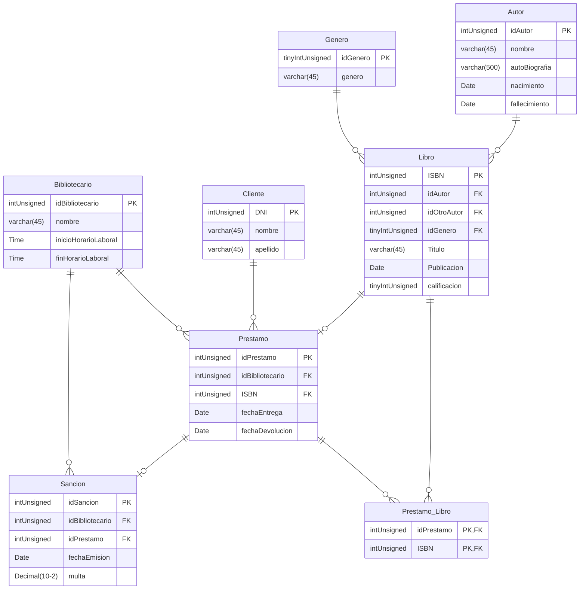

<br>
<h1 align= "center">BD_Biblioteca</h1>
<br>

## Integrantes

- Algañaras Diego
- Fernandez Leonel
- Pasandi Luka


## DER

<div align="center">


</div>

## Consultas

- Obtener el número total de libros por género, incluyendo géneros sin libros.
```sql
SELECT G.genero, COUNT(L.ISBN) AS TotalLibros
FROM Genero G
LEFT JOIN Libros L ON G.idGenero = L.idGenero
GROUP BY G.idGenero;
```
- Obtener los géneros que tienen más de 2 libros
```sql
SELECT G.genero, COUNT(L.ISBN) AS TotalLibros
FROM Genero G
LEFT JOIN Libros L ON G.idGenero = L.idGenero
GROUP BY G.idGenero
HAVING TotalLibros > 2;
```
- Listar bibliotecarios que han emitido más de 5 préstamos
```sql
SELECT B.idBibliotecario, COUNT(P.idPrestamo) AS TotalPrestamos
FROM Bibliotecario B
LEFT JOIN Prestamo P ON B.idBibliotecario = P.idBibliotecario
GROUP BY B.idBibliotecario
HAVING TotalPrestamos > 5;
```
- Obtener los autores que han emitido más de 3 libros y su año de nacimiento

```sql
SELECT A.autoBiografia, COUNT(L.ISBN) AS TotalLibros, A.nacimiento
FROM Autor A
LEFT JOIN Libros L ON A.DNI = L.idAutor
GROUP BY A.DNI, A.autoBiografia, A.nacimiento
HAVING TotalLibros > 3;
```

- Contar el número de sanciones emitidas por cada bibliotecario y mostrar solo aquellos que tienen más de 1 sanción

```sql
SELECT B.idBibliotecario, COUNT(S.idSancion) AS TotalSanciones
FROM Bibliotecario B
LEFT JOIN Sancion S ON B.idBibliotecario = S.idBibliotecario
GROUP BY B.idBibliotecario
HAVING TotalSanciones > 1;
```