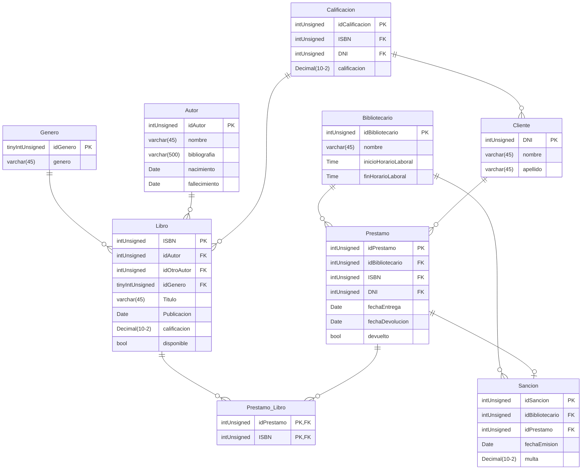

# ***BD_BIBLIOTECA***
# *By CiverAbentureros*

## Integrantes

- ### Algañaras Diego
- ### Lopez Angel
- ### Pasandi Luka

# DER

<div align="center">


</div>

# Consultas

- ### Obtener el número total de libros por género, incluyendo géneros sin libros, la cantidad de libros renombrarla como "TotalLibros", ordenar por cantidad de libros de mayor a menor.

```sql
SELECT genero, COUNT(ISBN) AS TotalLibros
FROM Genero G
LEFT JOIN Libro L ON G.idGenero = L.idGenero
GROUP BY genero
ORDER BY COUNT(ISBN) DESC;
```

- ### Mostrar los géneros que tienen más de un libro.

```sql
SELECT genero, COUNT(L.ISBN) AS TotalLibros
FROM Genero G
INNER JOIN Libro L ON G.idGenero = L.idGenero
GROUP BY genero
HAVING TotalLibros > 1;
```

- ### Mostrar el nombre de los bibliotecarios y su cantidad de prestamos, solo si han emitido mas de 4, ordenar de mayor a menor por cantidad de prestamos.

```sql
SELECT nombre, COUNT(idPrestamo) AS TotalPrestamos
FROM Bibliotecario B
INNER JOIN Prestamo P ON B.idBibliotecario = P.idBibliotecario
GROUP BY nombre
HAVING TotalPrestamos > 4
ORDER BY COUNT(idPrestamo);
```

-  ### Obtener el nombre y la fecha de nacimiento de aquellos autores que hayan emitido 2 o mas libros, ordenar de menor a mayor por año de nacimiento. 

```sql
SELECT nombre, nacimiento
FROM Autor A
INNER JOIN Libro L ON L.idAutor = A.idAutor
GROUP BY nombre, nacimiento
HAVING COUNT(*) > 2
ORDER BY nacimiento ASC;
```

- ### Mostrar el nombre del bibliotecario, la cantidad de sanciones que emitio y el destinatario de las sanciones, solo si la multa supera los 5000, ordenar por el nombre de los bibliotecarios de menor a mayor.

```sql
SELECT B.nombre, COUNT(*) AS TotalSanciones, C.nombre
FROM Bibliotecario B###
INNER JOIN Sancion S ON B.idBibliotecario = S.idBibliotecario
INNER JOIN Prestamo P ON P.idPrestamo = S.idPrestamo
INNER JOIN Cliente C ON C.DNI = P.DNI 
WHERE multa > 5000
GROUP BY B.nombre, C.nombre
ORDER BY B.nombre;
```


# Funciones

- ### Realizar una función que reciba como parametros, un DNI y dos fechas, con el fin de que muestre la suma total de todas las multas correspondientes a un cliente entre dichas fechas:

```sql
DELIMITER $$
DROP FUNCTION IF EXISTS sumaMultas $$
CREATE FUNCTION SumaMultas (unDNI INT UNSIGNED, minFecha DATE, maxFecha DATE)
RETURNS DECIMAL(10,2)
READS SQL DATA
BEGIN
    DECLARE sumaMultas DECIMAL;
    SELECT SUM(multa) INTO sumaMultas
    FROM Prestamo
    JOIN Sancion USING (idPrestamo)
    WHERE unDNI = DNI
    AND fechaEmision BETWEEN minFecha AND maxFecha;
    RETURN sumaMultas;
END $$
```

- ### Crear una función que reciba como parametro un idAutor y que muestre la cantidad de libros que posee el mismo:

```sql
DELIMITER $$
DROP FUNCTION IF EXISTS LibrosAutor $$
CREATE FUNCTION LibrosAutor (unIdAutor INT UNSIGNED)
RETURNS INT
READS SQL DATA
BEGIN
    DECLARE LibrosAutor INT;
    SELECT COUNT(*) INTO LibrosAutor
    FROM Libro
    WHERE idAutor = unIdAutor;
    RETURN LibrosAutor;
END $$
```

- ### Crear una funcion que reciba como parametro un idPrestamo, con el fin de calcular la cantidad de días restantes antes del vencimiento del mismo:

```sql
DELIMITER $$
DROP FUNCTION IF EXISTS DiasRestantes $$
CREATE FUNCTION DiasRestantes (unIdPrestamo INT UNSIGNED)
RETURNS INT
READS SQL DATA
BEGIN
    DECLARE DiasRestantes INT;
    SELECT DATEDIFF(fechaDevolucion, fechaEntrega) INTO DiasRestantes
    FROM Prestamo
    WHERE idPrestamo = unIdPrestamo;
    RETURN DiasRestantes;
END $$
```

- ### Crear una función que reciba como parametro un ISBN (PK de libro) y que en base a eso me muestre la cantidad total de veces que fue alquilado:

```sql
DELIMITER $$
DROP FUNCTION IF EXISTS CantPrestamos $$
CREATE FUNCTION CantPrestamos (unISBN INT UNSIGNED)
RETURNS INT
READS SQL DATA
BEGIN
    DECLARE CantPrestamos INT;
    SELECT COUNT(*) INTO CantPrestamos
    FROM Prestamo
    WHERE ISBN = unISBN;
    RETURN CantPrestamos;
END $$
```
# Procedimientos

- ### Crear los SP necesarios para dar de alta en todas las tablas:

```sql

```

# Triggers

- ### Crear un trigger que al hacer un insert en Calificacion, saque el promedio de todas las calificaciones de la calificacion del libro seleccionado, y actualize con ese valor en la correspondiente fila en la tabla Libro: 

```sql
DELIMITER $$
DROP TRIGGER IF EXISTS aftInsCalificacion $$
CREATE TRIGGER aftInsCalificacion AFTER INSERT ON Calificacion
FOR EACH ROW
BEGIN
    UPDATE Libro
    SET calificacion = (SELECT AVG(calificacion)
                       FROM Calificacion
                       WHERE ISBN = NEW.ISBN)
    WHERE ISBN = NEW.ISBN;
END $$
```

- ### Crear un trigger que no permita hacer un prestamo, si el libro no se encuentra disponible (Libro.disponible):

```sql
DELIMITER $$
DROP TRIGGER IF EXISTS befInsPrestamo $$
CREATE TRIGGER befInsPrestamo BEFORE INSERT ON Prestamo
FOR EACH ROW
BEGIN
    IF (!(SELECT disponible
          FROM Libro
          WHERE ISBN = NEW.ISBN))
    THEN
        SIGNAL SQLSTATE "45000"
        SET MESSAGE_TEXT = "El libro que se quiere utilizar no se encuentra disponible";
    END IF;
END $$
```

- ### Crear un trigger befInsPrestamo donde el cliente haga un prestamo si es que no tiene mas de 3 sanciones:

```sql
DELIMITER $$
DROP TRIGGER IF EXISTS befInsPrestamo $$
CREATE TRIGGER befInsPrestamo BEFORE INSERT ON Prestamo
FOR EACH ROW
BEGIN
    IF(3 < (SELECT COUNT(*) 
       FROM Sancion 
       JOIN Prestamo USING (idPrestamo) 
       WHERE DNI = NEW.DNI))
    THEN
        SIGNAL SQLSTATE "45000"
        SET MESSAGE_TEXT = "No se puede hacer un prestamo debido a que el Cliente que lo solita posee mas de tres sanciones";
    ELSE IF(FALSE = (SELECT disponible
                     FROM Libro
                     WHERE ISBN = NEW.ISBN))
    THEN
        SIGNAL SQLSTATE "45000"
        SET MESSAGE_TEXT = "No se puede efectuar un prestamo sobre un libro que no se encuentra disponible (Libro.disponible = 0)";
    END IF;
END $$
```


# Check

- ### Crear un Check el cual no permita ingresar valores de calificaciones menores a 0 ni mayores que 10:

```sql
CREATE TABLE Calificacion(
    idCalificacion INT UNSIGNED,
    ISBN INT UNSIGNED,
    DNI INT UNSIGNED,
    calificacion TINYINT UNSIGNED,

    CONSTRAINT PK_Calificacion PRIMARY KEY (idCalificacion),

    CONSTRAINT FK_Calificacion_Libro FOREIGN KEY (ISBN)
        REFERENCES Libro (ISBN),
    CONSTRAINT FK_Calificacion_Cliente FOREIGN KEY (DNI)
        REFERENCES Cliente (DNI),
    
    CONSTRAINT CHK_Calificacion CHECK (calificacion BETWEEN 0 AND 10)
);
```

- ### Crear un Check que valide si la fecha de fallecimiento del Autor es menor que la fecha de nacimiento, en el caso de que lo sea, no debera permitir el insert:

```sql
CREATE TABLE Autor(
    idAutor INT UNSIGNED,
    nombre VARCHAR(45) NOT NULL,
    bibliografia VARCHAR(500) NOT NULL,
    nacimiento DATE NOT NULL,
    fallecimiento DATE,

    CONSTRAINT PK_Genero PRIMARY KEY (idAutor),
    
    CONSTRAINT CHK_Autor CHECK (fallecimiento IS NULL OR fallecimiento > nacimiento)
);
```