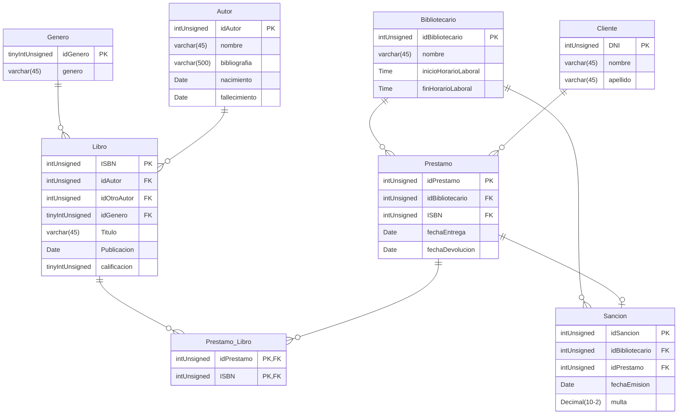

<br>
<h1 align= "center">BD_Biblioteca</h1>
<br>

## Integrantes

- Algañaras Diego
- Fernandez Leonel
- Pasandi Luka


## DER

<div align="center">


</div>

## Consultas

- Obtener el número total de libros por género, incluyendo géneros sin libros, la cantidad de libros renombrarla como "TotalLibros", ordenar por cantidad de libros de mayor a menor.

```sql
SELECT genero, COUNT(ISBN) AS TotalLibros
FROM Genero G
LEFT JOIN Libro L ON G.idGenero = L.idGenero
GROUP BY genero
ORDER BY COUNT(ISBN) DESC;
```

- Mostrar los géneros que tienen más de un libro.

```sql
SELECT G.genero, COUNT(L.ISBN) AS TotalLibros
FROM Genero G
INNER JOIN Libro L ON G.idGenero = L.idGenero
GROUP BY G.idGenero
HAVING TotalLibros > 1;
```

- Mostrar el nombre de los bibliotecarios y su cantidad de prestamos, solo si han emitido mas de 4, ordenar de mayor a menor por cantidad de prestamos.

```sql
SELECT nombre, COUNT(idPrestamo) AS TotalPrestamos
FROM Bibliotecario B
INNER JOIN Prestamo P ON B.idBibliotecario = P.idBibliotecario
GROUP BY nombre
HAVING TotalPrestamos > 4
ORDER BY COUNT(idPrestamo);
```

- Obtener el nombre y la fecha de nacimiento de aquellos autores que hayan emitido 2 o mas libros, ordenar de menor a mayor por año de nacimiento. 

```sql
SELECT nombre, nacimiento
FROM Autor A
INNER JOIN Libro L ON L.idAutor = A.idAutor
GROUP BY nombre, nacimiento
HAVING COUNT(*) > 2
ORDER BY nacimiento ASC;
```

- Mostrar el nombre del bibliotecario, la cantidad de sanciones que emitio, y el destinatario de las sanciones, solo si la multa supera los 5000, ordenar por el nombre de los bibliotecarios de menor a mayor.

```sql
SELECT B.nombre, COUNT(*) AS TotalSanciones, C.nombre
FROM Bibliotecario B
INNER JOIN Sancion S ON B.idBibliotecario = S.idBibliotecario
INNER JOIN Prestamo P ON P.idPrestamo = S.idPrestamo
INNER JOIN Cliente C ON C.DNI = P.DNI 
WHERE multa > 5000
GROUP BY B.nombre, C.nombre
ORDER BY B.nombre;
```