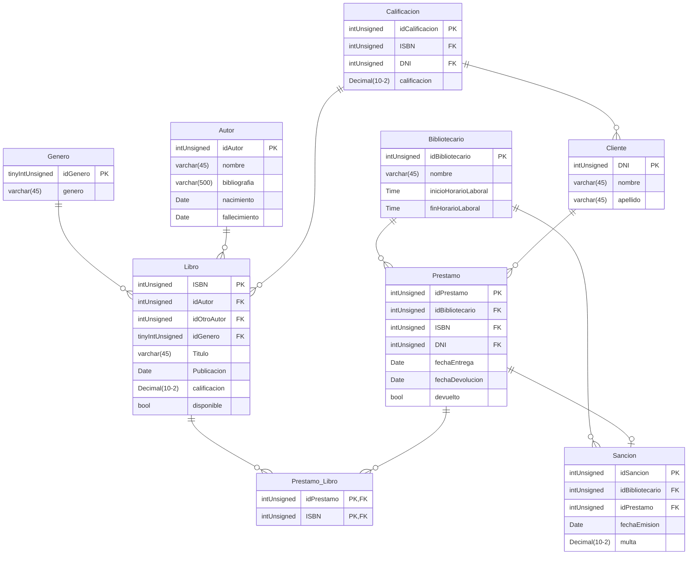

# DER

```mermaid
erDiagram
Genero{
    tinyIntUnsigned idGenero PK
    varchar(45) genero
}

Bibliotecario{
    intUnsigned idBibliotecario PK
    varchar(45) nombre
    Time inicioHorarioLaboral
    Time finHorarioLaboral
}

Autor{
    intUnsigned idAutor PK
    varchar(45) nombre
    varchar(500) bibliografia
    Date nacimiento
    Date fallecimiento
}

Cliente{
    intUnsigned DNI PK
    varchar(45) nombre
    varchar(45) apellido
}

Libro{
    intUnsigned ISBN PK
    intUnsigned idAutor FK
    intUnsigned idOtroAutor FK
    tinyIntUnsigned idGenero FK
    varchar(45) Titulo
    Date Publicacion
    Decimal(10-2) calificacion
    bool disponible
}

Sancion{
    intUnsigned idSancion PK
    intUnsigned idBibliotecario FK
    intUnsigned idPrestamo FK
    Date fechaEmision
    Decimal(10-2) multa
}

Prestamo{
    intUnsigned idPrestamo PK
    intUnsigned idBibliotecario FK
    intUnsigned ISBN FK
    intUnsigned DNI FK
    Date fechaEntrega
    Date fechaDevolucion
    bool devuelto
}

Calificacion{
    intUnsigned idCalificacion PK
    intUnsigned ISBN FK
    intUnsigned DNI FK
    Decimal(10-2) calificacion
}

Prestamo_Libro{
    intUnsigned idPrestamo PK, FK
    intUnsigned ISBN PK, FK
}

Genero||--o{Libro:""
Bibliotecario||--o{Sancion:""
Bibliotecario||--o{Prestamo:""
Cliente||--o{Prestamo:""
Prestamo||--o|Sancion:""
Libro||--o{Prestamo_Libro:""
Prestamo||--o{Prestamo_Libro:""
Autor||--o{Libro:""
Calificacion ||--o{ Libro:""
Calificacion ||--o{ Cliente:""
```

# DIAGRAMA DE CLASES

